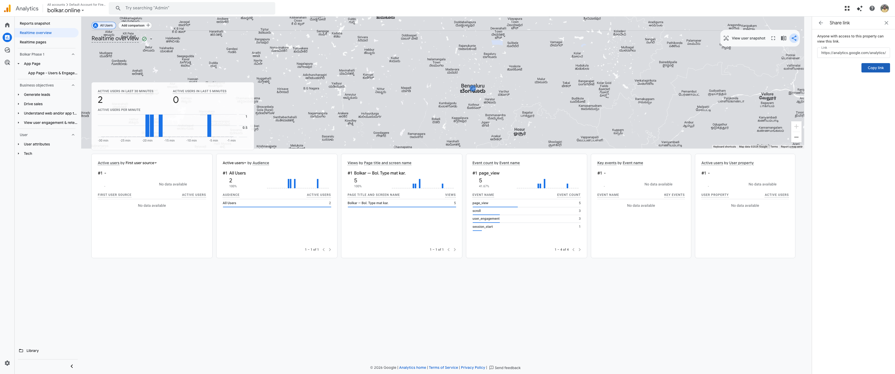

# Bolkar — Changelog

---

## Phase 1 — PWA: Desktop and Android
**Released:** March 2026
**Stack:** Next.js 16 (App Router) · TypeScript · Tailwind v4 · Sarvam AI Saaras v3

---

### Landing Page (`/`)

- **Hero section** — dark `#08030f` background with a purple radial glow, animated headline via `BolAnimation`, tagline, and two CTAs ("Try it free" → `/app`, "See how it works" → inline scroll)
- **Stats bar** — three trust signals: 22 languages, 4× faster than typing, zero signup required
- **Language chips** — scrolling carousel of 22 Indian languages Bolkar supports (powered by Sarvam's auto-detection)
- **Use-case accordion** — six rotating personas (Shop Owner, Student, Sales Rep, Doctor, Developer, Creator), each with a before/after "You say → Bolkar outputs" example; auto-advances every 4.5 s with a click-to-switch tab and progress bar
- **CTA footer** — secondary conversion section with direct link to `/app`
- **Navigation** — sticky frosted-glass nav with the Bolkar logo mark (gold ring + waveform bars + sound arcs SVG), brand wordmark, illuminated "Made with Sarvam" badge, and "Start for free" shimmer button

---

### App Page (`/app`)

#### Mode System
- **To English (Translate)** — speak any language including Hinglish, receive clean professional English; routes to `POST https://api.sarvam.ai/speech-to-text-translate`
- **As Spoken (Dictate)** — speak any language, receive text in that same language; routes to `POST https://api.sarvam.ai/speech-to-text`
- Both modes use `model=saaras:v3` and `language_code=unknown` (automatic language detection across 22 languages)
- Mode persisted in `localStorage` under key `bolkar-mode` and restored on next visit
- Mode toggle disabled during recording and processing to prevent mid-session switches
- Background glow and accent colour shift with mode: violet (`#7c3aed`) for To English, blue (`#2563eb`) for As Spoken

#### Mode Toggle UI
- Two pill buttons side by side; active mode gets a filled colour background
- Primary label on each pill cycles through seven language scripts (English → Hindi → Tamil → Telugu → Bengali → Kannada → Marathi) with a fade + upward-slide animation
- Label cycling is **synchronised with the example card** — both always display the same language at the same time
- Static subtitle below each label: "Speak any language → English" and "Speak → text in same language"
- Labels rendered in a fixed `9rem` width container with `overflow: hidden` to prevent layout shifts as script widths vary

#### Rotating Example Card
- Two-column card ("You say" | "Bolkar outputs") below the mode toggle
- Six examples per mode: To English covers Hinglish, Hindi, Tamil, Telugu, Bengali, Kannada; As Spoken covers Hindi, Tamil, Telugu, Bengali, Kannada, Marathi
- Auto-advances every 5 s with a 500 ms fade + slide transition; resets to index 0 on mode switch
- Dot indicators at the bottom allow manual navigation
- Each cell has a fixed `minHeight: 9rem` to prevent card height from shifting between examples

#### Recording Flow — Four States

**Idle**
- Large circular mic button with an ambient mode-coloured glow ring
- Live waveform below the mic rendered in the mode accent colour at low opacity (30%)
- "Click the mic to start" hint text
- "Use Bolkar anywhere" section if the device supports PiP or notifications (see below)

**Recording**
- Mic button turns red (`#ef4444`) with a dual-layer pulse-ring animation
- Live waveform activates: 40 frequency bars responding to real audio input in real time, with a noise-floor threshold and a 1.6× boost in the voice frequency range
- Recording timer in red below the waveform (`MM:SS`)
- "Recording — click to stop" hint; second click on the mic stops recording

**Processing**
- Mic button turns dark with a spinning loader
- "Processing your speech…" hint
- Brief intermediate state while Sarvam responds (typically 1–3 s)

**Result**
- Result card appears with:
  - Status badge ("Converted to English" or "Kept in your language") with a green dot
  - Animated speed badge counting up to the Sarvam API response time in ms
  - Full transcript text (scrollable if long)
- Text is **auto-copied to clipboard** immediately on result
- "Copied to clipboard" toast slides up from bottom of screen (2.5 s)
- Three action buttons:
  - **Copy** (primary, full-width, mode colour) — re-copies, shows "Copied!" for 2 s
  - **Edit** — switches transcript to an editable textarea; button becomes "Copy edited"
  - **Dismiss** — returns to idle immediately
- Card auto-dismisses after 10 s if no action is taken

**Error**
- Red error card with the error message
- "Try again →" link resets to idle

#### History Panel
- Accessible via the "History" button in the top nav; shows a count badge when items exist
- Slide-in panel from the right edge (full height, 384 px wide on desktop)
- Stores up to 10 most recent conversions locally in `localStorage` under key `bolkar-history` — never sent to a server
- Each item: mode badge ("→ English" in violet or "As spoken" in blue), relative timestamp ("2m ago", "3h ago"), Sarvam speed badge, and up to 3 lines of transcript
- "Clear all" button in panel header
- Footer reminder: "Stored locally in your browser · Never sent to a server"

---

### Use Bolkar Anywhere

#### Float It — Picture-in-Picture Bubble (Desktop, Chrome only)
- Launches a `documentPictureInPicture` window (always-on-top, works across all apps system-wide)
- One-time "Tap to activate" overlay required by Chrome for user-activation gating
- Compact bubble with the full recording flow: mode toggle, example strip, mic button, result card, copy button
- Example strip in the PiP window rotates through the same six examples as the main page, synced by mode
- Mode labels in PiP also cycle in the same language sequence, driven by the example index
- Clipboard fallback: tries `navigator.clipboard`, falls back to `document.execCommand("copy")` for PiP focus constraints
- "Active" badge shown on the "Float it" button while the PiP window is open

#### Pin It — Android Notification (Android / Chrome with notification permission)
- Pins a persistent notification tagged `bolkar-pin` to the Android notification bar
- One tap on the notification opens the Bolkar app from any other app
- Button toggles to "Unpin it" when active; shows "Pinned" badge
- Uses the PWA service worker to place and clear the notification

---

### PWA
- `public/manifest.json` — `name`: "Bolkar — Bol. Type mat kar.", `short_name`: "Bolkar", `start_url`: "/app", `display`: "standalone", `theme_color`: `#7c3aed`, `background_color`: `#08030f`
- SVG icon at `/icons/icon.svg` (maskable, any size)
- Installable to Android home screen via Chrome prompt; installable as desktop PWA

---

### Analytics
- Google Analytics GA4 (`G-FVBM65R4KJ`) integrated in the Next.js app
- Tracks page views, sessions, users, engagement, and geography automatically
- Currently no custom recording-level events (planned for Phase 2)
- Data retention set to 14 months (Admin → Data Settings → Data Retention)
- **"Bolkar Phase 1" collection** created in GA4 Library with the following reports:
  - App Page — Users & Engagement (filtered to `/app`, metrics: total users, new users, engaged sessions, engagement rate, avg session duration)
  - New vs Returning users (Retention report)
  - Engagement rate (Engagement overview)
  - India traffic share (User attributes → Demographic details)
  - Device split (Tech overview)
  - Landing → `/app` funnel (Funnel exploration)
  - Traffic sources (Traffic acquisition)
- First real users confirmed via Realtime overview — traffic from India (Karnataka / Bengaluru region)

---

### Backend / API

- **API route** — `POST /api/transcribe` — accepts `FormData` with `audio` blob and `mode` string; routes to the correct Sarvam endpoint; returns `{ transcript, processingMs }` or `{ error }`
- **Demo mode** — if `SARVAM_API_KEY` is absent, returns a placeholder transcript without crashing, enabling local development without an API key
- **Audio format** — WebM (preferred: `audio/webm;codecs=opus`; fallback: `audio/ogg;codecs=opus`; final fallback: browser default); codec suffix stripped before sending to Sarvam

---

### Design System
- **Background:** `#08030f` (landing) / mode-specific dark bg on `/app`
- **To English accent:** violet `#7c3aed` / `#c4b5fd`
- **As Spoken accent:** blue `#2563eb` / `#93c5fd`
- **Recording colour:** red `#ef4444`
- **Logo mark:** gold metallic SVG — outer ring + five waveform bars + two sound arcs
- **Animations:** `animate-pulse-ring`, `animate-fade-in-up`, `animate-toast-slide`, `btn-shimmer`; defined as `@keyframes` in `globals.css` (Tailwind v4 CSS-first config)

---

### PRD Coverage Check

| PRD Phase 1 Requirement | Status |
|---|---|
| Desktop floating draggable mic bubble across all apps | ✅ PiP bubble via `documentPictureInPicture` |
| Text auto-copied to clipboard on result | ✅ Auto-copy + manual copy + toast |
| Android: install to home screen via PWA | ✅ `manifest.json` configured |
| Android: persistent notification in tray | ✅ PWA notification with `requireInteraction` |
| As Spoken / Dictate Mode | ✅ Routes to `/speech-to-text` |
| To English / Translate Mode | ✅ Routes to `/speech-to-text-translate` |
| Automatic language detection | ✅ `language_code=unknown` on every call |
| Local conversion history — last 10 results | ✅ `localStorage`, max 10 items |
| Mode toggle cycles through 7 languages | ✅ Synced with example card |
| Rotating example card with 6 examples per mode | ✅ 5 s auto-advance, dot indicators |
| History panel with clear and timestamps | ✅ Slide-in panel, `timeAgo`, clear all |
| PiP bubble with full recording functionality | ✅ Including example rotation |
| Notification pin from any app | ✅ PWA notification toggle |
| PWA manifest with icons and shortcuts | ✅ |
| Google Analytics GA4 | ✅ Property `G-FVBM65R4KJ` |
| Demo fallback without API key | ✅ Returns placeholder transcript |
